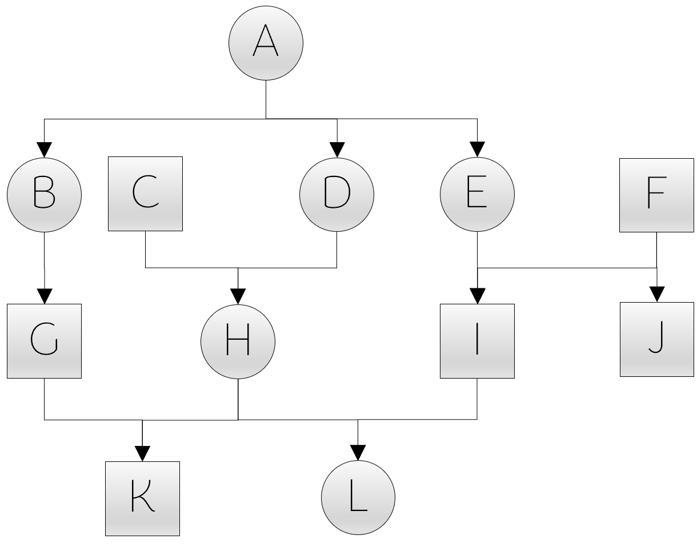

# pedigree programme
## Getting Started

Installation guide

  
- to download the programme either clone the repository or download (and don't forget to unzip) the _source_ folder to your local filesystem
  - you can clone the repository by clicking on the green CODE button and copy the URL [https://github.com/Hendrikjen/pedigree_programme.git](https://github.com/Hendrikjen/pedigree_programme.git)
  - open GitBash or a bash terminal (for instance in Visual Studio Code) and navigate to desired folder where you want to locate the cloned repository
  - clone the repository with the command `git clone https://github.com/Hendrikjen/pedigree_programme.git`
- after downloading or cloning the source code, open the command line and navigate into the folder _pedigree_programme/source/_
  - you can check with `ls` if there are multiple Headerfiles (.h) and the respective source code files (.cpp) as well as _main.cpp_ and the makefile _makefile_pedigree_programme_
- run in the command line `make -f makefile_pedigree_programme`
- use the command `./pedigree_programme` to start the programme (depending on what you want to do, you have to add further arguments after the command)

Command line arguments

Input requirements

## Example

Input/Output files

  

 Input file

|ID|sex|birthseason|mom|sire|DOB|DOD|nonsire|nondam|
| ------------- | ------------- | ------------- | ------------- | ------------- | ------------- | ------------- | ------------- | ------------- |
|A|f|1905|unknown|unknown|01-01-1900|NA|NA|NA|
|B|f|1911|A|unknown|01-01-1911|NA|NA|NA|
|C|m|1912|unknown|unknown|01-01-1912|NA|NA|NA|
|D|f|1913|A|unknown|01-01-1913|NA|NA|NA|
|E|f|1914|A|unknown|01-01-1914|NA|NA|NA|
|F|m|1915|unknown|unknown|01-01-1915|NA|NA|NA|
|G|m|1920|B|unknown|01-01-1920|NA|NA|NA|
|H|f|1921|D|C|01-01-1921|NA|NA|NA|
|I|m|1922|E|F|01-01-1922|NA|NA|NA|
|J|m|1923|E|F|01-01-1923|NA|NA|NA|
|K|m|1928|H|G|01-01-1928|NA|NA|NA|
|L|f|1929|H|I|01-01-1929|NA|NA|NA|

[example_input_pedigree.txt](example/example_input_pedigree.txt) 

 Output file (pedigree): additional pedigree info like generational depth and minimal inbreeding value

|ID|sex|BS|mom|sire|DOB|DOD|pot_sire|pot_mom|full_generations|min_f|
| ------------- | ------------- | ------------- | ------------- | ------------- | ------------- | ------------- | ------------- | ------------- | ------------- | ------------- |
|A|f|1905|unkn_f|unkn_m|1-1-1900|0-0-0|NA|NA|1|0.000000000000000|
|B|f|1911|A|unkn_m|1-1-1911|0-0-0|NA|NA|1|0.000000000000000|
|C|m|1912|unkn_f|unkn_m|1-1-1912|0-0-0|NA|NA|1|0.000000000000000|
|D|f|1913|A|unkn_m|1-1-1913|0-0-0|NA|NA|1|0.000000000000000|
|E|f|1914|A|unkn_m|1-1-1914|0-0-0|NA|NA|1|0.000000000000000|
|F|m|1915|unkn_f|unkn_m|1-1-1915|0-0-0|NA|NA|1|0.000000000000000|
|G|m|1920|B|unkn_m|1-1-1920|0-0-0|NA|NA|1|0.000000000000000|
|H|f|1921|D|C|1-1-1921|0-0-0|NA|NA|2|0.000000000000000|
|I|m|1922|E|F|1-1-1922|0-0-0|NA|NA|2|0.000000000000000|
|J|m|1923|E|F|1-1-1923|0-0-0|NA|NA|2|0.000000000000000|
|K|m|1928|H|G|1-1-1928|0-0-0|NA|NA|2|0.031250000000000|
|L|f|1929|H|I|1-1-1929|0-0-0|NA|NA|3|0.031250000000000|

[example_output_pedigree_info.txt](example/example_output_pedigree_info.txt)

 Output file (dyadlist): path characteristics

|ID 1|ID 2|dyad|relatedness coefficient|paths|pathline|kinline|LCA|depth|kinlabel|fullhalf|
| ------------- | ------------- | ------------- | ------------- | ------------- | ------------- | ------------- | ------------- | ------------- | ------------- | ------------- |
|A|B|A_B|0.500000000000000|A@B|ff|mat|A|0/1|daughter-mother|half|
|A|C|A_C|0|NA|NA|NA|NA|NA|nonkin|NA|
|A|D|A_D|0.500000000000000|A@D|ff|mat|A|0/1|daughter-mother|half|
|A|E|A_E|0.500000000000000|A@E|ff|mat|A|0/1|daughter-mother|half|
|A|F|A_F|0|NA|NA|NA|NA|NA|nonkin|NA|
|A|G|A_G|0.250000000000000|A@B@G|ffm|mat|A|0/2|grand-son-grand-mother|half|
|A|H|A_H|0.250000000000000|A@D@H|fff|mat|A|0/2|grand-daughter-grand-mother|half|
|A|I|A_I|0.250000000000000|A@E@I|ffm|mat|A|0/2|grand-son-grand-mother|half|
|A|J|A_J|0.250000000000000|A@E@J|ffm|mat|A|0/2|grand-son-grand-mother|half|
|A|K|A_K|0.250000000000000|A@B@G@K/@/A@D@H@K|ffmm/@/fffm|mixed/@/mat|A/@/A|0/3/@/0/3|great-grand-son-great-grand-mother/@/great-grand-son-great-grand-mother|half/@/half|
|A|L|A_L|0.250000000000000|A@E@I@L/@/A@D@H@L|ffmf/@/ffff|mixed/@/mat|A/@/A|0/3/@/0/3|great-grand-daughter-great-grand-mother/@/great-grand-daughter-great-grand-mother|half/@/half|
|B|C|B_C|0|NA|NA|NA|NA|NA|nonkin|NA|
|B|D|B_D|0.250000000000000|B@A@D|fff|mat|A|1/1|sisters|half|
|B|E|B_E|0.250000000000000|B@A@E|fff|mat|A|1/1|sisters|half|
|B|F|B_F|0|NA|NA|NA|NA|NA|nonkin|NA|
|B|G|B_G|0.500000000000000|B@G|fm|mat|B|0/1|son-mother|half|
|B|H|B_H|0.125000000000000|B@A@D@H|ffff|mat|A|1/2|niece-aunt|half|
|B|I|B_I|0.125000000000000|B@A@E@I|fffm|mat|A|1/2|nephew-aunt|half|
|B|J|B_J|0.125000000000000|B@A@E@J|fffm|mat|A|1/2|nephew-aunt|half|
|B|K|B_K|0.312500000000000|B@G@K/@/B@A@D@H@K|fmm/@/ffffm|mixed/@/mat|B/@/A|0/2/@/1/3|grand-son-grand-mother/@/grandnephew-grandaunt|half/@/half|
|B|L|B_L|0.125000000000000|B@A@D@H@L/@/B@A@E@I@L|fffff/@/fffmf|mat/@/mixed|A/@/A|1/3/@/1/3|grandniece-grandaunt/@/grandniece-grandaunt|half/@/half|
|C|D|C_D|0|NA|NA|NA|NA|NA|nonkin|NA|
|C|E|C_E|0|NA|NA|NA|NA|NA|nonkin|NA|
|C|F|C_F|0|NA|NA|NA|NA|NA|nonkin|NA|
|C|G|C_G|0|NA|NA|NA|NA|NA|nonkin|NA|
|C|H|C_H|0.500000000000000|C@H|mf|pat|C|0/1|daughter-father|half|
|C|I|C_I|0|NA|NA|NA|NA|NA|nonkin|NA|
|C|J|C_J|0|NA|NA|NA|NA|NA|nonkin|NA|
|C|K|C_K|0.250000000000000|C@H@K|mfm|mixed|C|0/2|grand-son-grand-father|half|
|C|L|C_L|0.250000000000000|C@H@L|mff|mixed|C|0/2|grand-daughter-grand-father|half|
|D|E|D_E|0.250000000000000|D@A@E|fff|mat|A|1/1|sisters|half|
|D|F|D_F|0|NA|NA|NA|NA|NA|nonkin|NA|
|D|G|D_G|0.125000000000000|D@A@B@G|fffm|mat|A|1/2|nephew-aunt|half|
|D|H|D_H|0.500000000000000|D@H|ff|mat|D|0/1|daughter-mother|half|
|D|I|D_I|0.125000000000000|D@A@E@I|fffm|mat|A|1/2|nephew-aunt|half|
|D|J|D_J|0.125000000000000|D@A@E@J|fffm|mat|A|1/2|nephew-aunt|half|
|D|K|D_K|0.312500000000000|D@A@B@G@K/@/D@H@K|fffmm/@/ffm|mixed/@/mat|A/@/D|1/3/@/0/2|grandnephew-grandaunt/@/grand-son-grand-mother|half/@/half|
|D|L|D_L|0.312500000000000|D@A@E@I@L/@/D@H@L|fffmf/@/fff|mixed/@/mat|A/@/D|1/3/@/0/2|grandniece-grandaunt/@/grand-daughter-grand-mother|half/@/half|
|E|F|E_F|0|NA|NA|NA|NA|NA|nonkin|NA|
|E|G|E_G|0.125000000000000|E@A@B@G|fffm|mat|A|1/2|nephew-aunt|half|
|E|H|E_H|0.125000000000000|E@A@D@H|ffff|mat|A|1/2|niece-aunt|half|
|E|I|E_I|0.500000000000000|E@I|fm|mat|E|0/1|son-mother|half|
|E|J|E_J|0.500000000000000|E@J|fm|mat|E|0/1|son-mother|half|
|E|K|E_K|0.125000000000000|E@A@D@H@K/@/E@A@B@G@K|ffffm/@/fffmm|mat/@/mixed|A/@/A|1/3/@/1/3|grandnephew-grandaunt/@/grandnephew-grandaunt|half/@/half|
|E|L|E_L|0.312500000000000|E@I@L/@/E@A@D@H@L|fmf/@/fffff|mixed/@/mat|E/@/A|0/2/@/1/3|grand-daughter-grand-mother/@/grandniece-grandaunt|half/@/half|
|F|G|F_G|0|NA|NA|NA|NA|NA|nonkin|NA|
|F|H|F_H|0|NA|NA|NA|NA|NA|nonkin|NA|
|F|I|F_I|0.500000000000000|F@I|mm|pat|F|0/1|son-father|half|
|F|J|F_J|0.500000000000000|F@J|mm|pat|F|0/1|son-father|half|
|F|K|F_K|0|NA|NA|NA|NA|NA|nonkin|NA|
|F|L|F_L|0.250000000000000|F@I@L|mmf|pat|F|0/2|grand-daughter-grand-father|half|
|G|H|G_H|0.062500000000000|G@B@A@D@H|mffff|mat|A|2/2|1st-cousins|half|
|G|I|G_I|0.062500000000000|G@B@A@E@I|mfffm|mat|A|2/2|1st-cousins|half|
|G|J|G_J|0.062500000000000|G@B@A@E@J|mfffm|mat|A|2/2|1st-cousins|half|
|G|K|G_K|0.531250000000000|G@K/@/G@B@A@D@H@K|mm/@/mffffm|pat/@/mat|G/@/A|0/1/@/2/3|son-father/@/1st-cousins-once-removed|half/@/half|
|G|L|G_L|0.062500000000000|G@B@A@D@H@L/@/G@B@A@E@I@L|mfffff/@/mfffmf|mat/@/mixed|A/@/A|2/3/@/2/3|1st-cousins-once-removed/@/1st-cousins-once-removed|half/@/half|
|H|I|H_I|0.062500000000000|H@D@A@E@I|ffffm|mat|A|2/2|1st-cousins|half|
|H|J|H_J|0.062500000000000|H@D@A@E@J|ffffm|mat|A|2/2|1st-cousins|half|
|H|K|H_K|0.531250000000000|H@K/@/H@D@A@B@G@K|fm/@/ffffmm|mat/@/mixed|H/@/A|0/1/@/2/3|son-mother/@/1st-cousins-once-removed|half/@/half|
|H|L|H_L|0.531250000000000|H@L/@/H@D@A@E@I@L|ff/@/ffffmf|mat/@/mixed|H/@/A|0/1/@/2/3|daughter-mother/@/1st-cousins-once-removed|half/@/half|
|I|J|I_J|0.500000000000000|I@E@J/@/I@F@J|mfm/@/mmm|mat/@/pat|E/@/F|1/1/@/1/1|brothers/@/brothers|full/@/full|
|I|K|I_K|0.062500000000000|I@E@A@D@H@K/@/I@E@A@B@G@K|mffffm/@/mfffmm|mat/@/mixed|A/@/A|2/3/@/2/3|1st-cousins-once-removed/@/1st-cousins-once-removed|half/@/half|
|I|L|I_L|0.531250000000000|I@L/@/I@E@A@D@H@L|mf/@/mfffff|pat/@/mat|I/@/A|0/1/@/2/3|daughter-father/@/1st-cousins-once-removed|half/@/half|
|J|K|J_K|0.062500000000000|J@E@A@D@H@K/@/J@E@A@B@G@K|mffffm/@/mfffmm|mat/@/mixed|A/@/A|2/3/@/2/3|1st-cousins-once-removed/@/1st-cousins-once-removed|half/@/half|
|J|L|J_L|0.281250000000000|J@E@A@D@H@L/@/J@E@I@L/@/J@F@I@L|mfffff/@/mfmf/@/mmmf|mat/@/mixed/@/pat|A/@/E/@/F|2/3/@/1/2/@/1/2|1st-cousins-once-removed/@/niece-uncle/@/niece-uncle|half/@/full/@/full|
|K|L|K_L|0.296875000000000|K@H@L/@/K@H@D@A@E@I@L/@/K@G@B@A@D@H@L/@/K@G@B@A@E@I@L|mff/@/mffffmf/@/mmfffff/@/mmfffmf|mat/@/mixed/@/mixed/@/mixed|H/@/A/@/A/@/A|1/1/@/3/3/@/3/3/@/3/3|siblings/@/2nd-cousins/@/2nd-cousins/@/2nd-cousins|half/@/half/@/half/@/half|

  
[example_output_dyadlist.txt](example/example_output_dyadlist.txt)

Output explanation (path characteristics)

To further explain the column in the dyadlist output, we will look on the examplary dyad (E_G) from the pedigree example above. The focal individuals E (circle = female) and G (square = male) are related only by maternal ancestors (kinline = mat), whereby the lowest common ancestor A is one edge apart from E and two from G (depth = 1/2) which codes in combination with the sex for the kinlabel nephew/aunt. Each focal has at least one unknown parent, therefore the min DGD is 1.

|name | explanation | example |
| ------------- | ------------- | ------------- |
|path | consecutive list of nodes along the relatedness path (edge directions are left unregarded) | E@A@B@G|
|lca | lowest common ancestor within path | A |
|pathline | sequence of sexes (f/m/u) along the path | fffm |
|kinline | whether the path consists solely of maternal or paternal ancestors; “mixed” if both sexes occur | mat |
|depth | path length from LCA to each focal | 1/2 |
|kinlabel | kinclass label based on the table of consanguinity (see below) | nephew-aunt |
|fullhalf | whether two identical paths exist with different common ancestors, e.g. differentiation between full- and half-siblings | half |
|min\_DGD | minimal dyadic genealogical depth states the pedigree completeness for the dyad; i.e. the minimal amount of fully resolved generations starting from both focals | 1 |

https://upload.wikimedia.org/wikipedia/commons/0/0d/Table_of_Consanguinity_showing_degrees_of_relationship.svg

  

## Implementation

Relatedness Coefficient

The genealogy G is delineated as a directed, acyclic graph with two distinct classes of vertices, $V_1$ (males) and $V_2$ (females), with each node referring to an unique individual.
Edges are defined as unidirectional parent/offspring relationships which means that each child has one edge coming from its mother, and one coming from its father. To ensure that each individual has a maternal and paternal edge, the graph comprises of two additionally, imaginary nodes $\rho_1\ \epsilon\ V_1$ and $\rho_2\ \epsilon\ V_2$ which are the compensatory substitute in case of an unknown dam or sire.
Imaginary individuals were considered as unrelated to each other as well as unrelated to any other individual $x\ \epsilon\ V: f\left(\rho_1,\rho_2\right)=f\left(x,\rho_1\right)=f\left(x,\rho_2\right)=0$, while the relatedness of an individual $x\ \epsilon\ V$ to itself is set as $f\left(x,x\right)=1$. Otherwise, the relatedness coefficient $f\left(x,y\right)$ of a dyad, consisting of the two vertices $x,\ y\ \epsilon\ V$, is given by the recursive formula 
$$f\left(x,y\right)=\ \frac{1}{4}\left[f\left(x_1,y_1\right)+f\left(x_1,y_2\right)+f\left(x_2,y_1\right)+f(x_2,y_2)\right]$$
with $x_1,\ x_2$ as parental vertices of $x$ and $y_1,\ y_2$ as parents of $y (x_1,\ y_1\ \epsilon\ V_1$ and $x_2,\ y_2\ \epsilon\ V_2$). Furthermore, the relatedness coefficient calculation between an individual $x$ and its ancestor $x_i$ is expressed as 
$$f\left(x,x_i\right)=\ \frac{1}{2}\left[f\left(x_1,x_i\right)+f\left(x_2,x_i\right)\right]$$
with $x,\ x_i\ \epsilon\ V;\ x_1\ \epsilon\ V_1$ and $x_2\ \epsilon\ V_2$ as parents of $x$; and more specific in case $x_i \equiv x_1 \lor x_2$, the relatedness between parent and offspring is calculated by 
$$f\left(x,x_1\right)=\ \frac{1}{2}\left[1+f\left(x_1,x_2\right)\right]$$
Based on these recursive functions, the programme computes the relatedness between a dyad stepwise - comparable with a breadth-first-search - until either their lowest common ancestor is found, or it terminates due to a trivial solution.

Simulated Annealing

#### Adapted Simulated Annealing Algorithm - Overview
  
1.  Get all gaps to fill in the incomplete pedigree
2.  Create start solution by randomly determining missing parents from the pool of fitting parents for each gap
3.  Relatedness coefficient calculation for each relevant dyad (dyads with IBD values to compare to)
4.  Compare old versus new relatedness values for each relevant dyad and get the total difference between start solution and incomplete pedigree which ultimately serves as fitness function to be minimized: $$F =\Sigma\ |f(x,y) - g(x,y) | \to min$$ (with $f(x,y)$ as the pedigree-based dyadic relatedness and $g(x,y)$ as the dyadic realized relatedness)
6.  Save current total difference as (currently) best difference and  start solution as (currently) best pedigree
7.  While current temperature > stop temperature:
    -  Create neighbor solution (exchange one potential parent with another fitting candidate)
    -  Calculate new relatedness values for each  dyad in associated to one of the three altered individuals (the individual with the missing parent, the newly chosen parent candidate and the previously chosen parent candidate)
    -  Compare old vs. new relatedness values for each relevant dyad and get the total difference between current pedigree (starting point for neighbor solution) and neighbor solution
    -  if the new solution is worse, use the metropolis acceptance criterion to determine whether the new solution will be rejected or not: $$e^\frac{F_{n}-F_{c}}{T} > X\to [0,1]$$ 
 (with $F_n$ as fitness function of the new solution and $F_c$ of the current solution; $T$ as temperature and $X$ as random number in the range between 0 and 1)
    - if true, set new solution as new current solution (starting point for next solution), else reject new solution and previous current solution endures
    - if necessary update best difference/pedigree
7.  save last pedigree solution in file

## Contribution and citation

...

 

 
