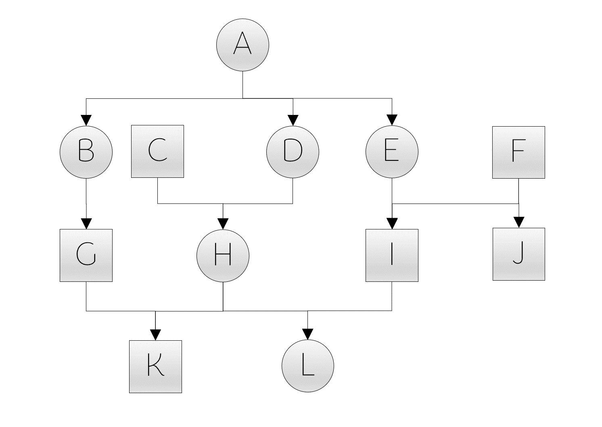

# TRACE - _Tool for pedigree Relatedness Analysis and Coefficient Estimation_

The software TRACE is a pedigree analysis tool, which was developed and implemented as part of a bioinformatic's master thesis in 2023 at Leipzig University. It is a C++ written console application, that was designed to calculate dyadic relatedness coefficients from a given pedigree without being limited by the number of considered generations, the number of individuals, or the incompleteness of the pedigree itself. Additionally, TRACE provides some further information about the respective relatedness paths between the focal individuals, such as the name and sex of ancestors along the path, the most recent common ancestors (LCA = lowest common ancestor), the kin class (e.g. siblings or cousins), or the minimal detectable inbreeding value for each individual. The functionality and accuracy were adequately tested with multiple simulated populations as well as with an existing multi-generational pedigree established for the free-ranging population of rhesus macaques (Macaca mulatta) on the island of Cayo Santiago (Puerto Rico, USA) that covers a time span of over 60 years and consists of a total of 12 049 individuals [^1]. Contrary to other pedigree analyses, which are often limited in the number of considered generations (like [^1]), the graph-theoretical approach enables a generational unrestricted calculation of the dyadic relatedness coefficients. However, it might not be suitable for highly inbred populations since it does not include inbreeding coefficients of common ancestors (see more information in the section _Implementation/Relatedness coefficient_).

Since scientists working on wild populations often have to deal with partial pedigrees (mainly due to unknown sires), the second part of the programme focuses on the implementation of an adapted simulated annealing algorithm to find the best solution for a fully-reconstructed pedigree based on "true" relatedness values. True relatedness means in this context dyadic relatedness values, that provide more information about the individuals with incomplete ancestry, than can be obtained from the partial pedigree, like relatedness values calculated from a fully-reconstructed pedigree or - closer to a realistic application - realised relatedness values. Realised relatedness (the proportion of DNA two individuals actually share instead of an average) can be estimated based on the length and number of IBD segments. Identified through dense and genome-wide sets of SNPs (single nucleotide polymorphisms) in whole genome sequencing data, short identity-by-descent (IBD) segments indicate rather distant kin due to more meioses in between, that are responsible for the length reduction [^2] [^3]. Eventually, the algorithm aims to provide a pedigree without gaps for which the difference between the given realised relatedness values and the simultaneously calculated pedigree-derived relatedness coefficients is minimal over all dyads (see more information in the section _Implementation/Simulated annealing_). While patterns of relatedness in group-living animals with promiscuous mating can be really complex, assessing dyadic relatedness from sequencing data is providing the most accurate way to do so. However, at the behavioural level it will be important to still consider kin classes (e.g. maternal half-siblings, paternal cousins etc.) instead of using a global measure of IBD.

## Getting Started

Installation guide

 
- download (and don't forget to unzip) the repository to your local filesystem
- after downloading the source code, open the command line and navigate within the terminal into the folder _pedigree_programme/source/_
  - you can use `ls` to check if you are in the correct folder and if all the necessary files were downloaded: multiple headerfiles (.h), the respective source code files (.cpp), _main.cpp_ and the makefile _makefile_pedigree_programme_
- run in the command line `make -f makefile_pedigree_programme`
  - this program is written using C++17 features and relies on the C++ Standard Library, which is typically included within the C++ compiler. Therefore, no additional library installations are necessary. However, please ensure that your compiler supports C++17 standards. 
  - if you have trouble with the make command on windows e.g. _'make' is not recognized as an internal or external command, operable programme or batch file._
    - either download [Cygwin](https://www.cygwin.com/install.html), use the setup exe to install _make_ and _gcc/g++_, move the programme folder to Cygwin and run the command in the Cygwin Terminal
    <!-- Cygwin Setup Installation Tutorial Youtube by C Plus+: https://www.youtube.com/watch?v=2ypfJZ6YuVo -->
    - or install [MinGW](https://sourceforge.net/projects/mingw/files/Installer/mingw-get-setup.exe/download), set a new environment variable to the bin folder of mingw, install make by `mingw-get install mingw32-make` or the MinGW Interface (started by `mingw-get`) and use the command `mingw32-make -f makefile_pedigree_programme` instead
  <!-- MinGW Setup Installation Tutorial Youtube by PascalLandau: https://www.youtube.com/watch?v=taCJhnBXG_w-->
- now you can use the command `./pedigree_programme` to start TRACE
- for general information you can type `./pedigree_programme -h` to list all possible command line arguments, or `./pedigree_programme -v` to get the current version

Command line arguments

TRACE provides three different functionalities: "relatedness", "simulation", and "annealing", which could be chosen by the command line argument `-f <functionality>`.
 - _relatedness_: calculates the dyadic relatedness (+ path characteristics) from a given (partial or complete) pedigree
 - _simulation_: simulates a random population and returns a complete pedigree
 - _annealing_: starts a simulated annealing algorithm to fill the parental gaps within a partial pedigree using dyadic values of realised relatedness (IBD)
 - if no argument is given, TRACE starts without a task, gives a short warning, and terminates

For each mode, further required and optional arguments are listed below:

functionality == relatedness

#### required arguments
- `-p <input_pedigree>` [string]: path to a pedigree file, e.g. _pedigree.txt_

#### optional arguments
- `-c <cores>` [int]
  - **options**: number of cores for multiprocessing
  - **default**: 1 (no multiprocessing)
- `-d <input_dyadlist>` [string]
  - **options**: path to file with selected dyads e.g. _dyad_selection.txt_
  - **default**: [empty] (all dyads within the pedigree will be analysed)
- `-e <output_extend>` [string]
  - **options**:
    - _full_: returns the full dyadlist output, including path characteristics
    - _reduced_: returns only dyadlist with dyadic relatedness coefficients
  - **default**: full
- `-l <generation_limit>` [int]
  - **options**: restricts the distance to potential lowest common ancestors, e.g. if generation_limit == _3_, only paths up to the grandparent generation will be returned, great-grand-parents will be considered as unrelated
  - **default**: [empty] (no limitation; all ancestors of a focal will be considered as potential lowest common ancestor)
- `-o <output>` [string]
  - **options**: custom output name (prefix) e.g. if output == _programme_output_, the resulting output files will be named "programme_output_dyadlist.txt" and "programme_output_info.txt"
  - **default**: [empty] (the input file name will be used as a prefix)
- `-r <reduce_node_space>` [bool]
  - **options**:
    - _T_:  [true] before calculating the dyadic relatedness, the number of individuals will be reduced which means that only descendants of the focal's common ancestors will be considered in the analysis (it effectively reduces the search space without affecting the result, but might be only beneficial in almost completely known pedigrees with a long history due to the extra computational cost)
    - _F_: [false] no prior narrowing of the search space
  - **default**: false

#### Example
`./pedigree_programme -f relatedness -p pedigree.txt -e reduced -c 5`

functionality == simulation

#### required arguments
- `-n <start_individual>` [int]: number of individuals at the start of the simulation
- `-s <simulation_duration>` [int]: number of years considered in pedigree to restrict the duration of the simulation

#### optional arguments
- `-a <max_age>` [int]
  - **options**: species-/population specific age maximum (individuals who reach the maximum age will decease in the following year)
  - **default**: 30
- `-b <birth_rate>` [double]
  - **options**: specifies the annual increment in the number of offspring born each year during the population simulation
  - **default**: 4.0
- `-q <death_rate>` [double]
  - **options**: specifies the annual increment in the number of deaths each year during the population simulation
  - **default**: 3.0
- `-y <default_year>` [int]
  - **options**: start year for population simulation
  - **default**: 1900

#### Example
`./pedigree_programme -f simulation -n 20 -s 10 -y 1938`

functionality == annealing

#### required arguments
- `-d <input_dyads_complete>` [string]: path to dyadlist with realised relatedness values, e.g. _true_dyads.txt_
- `-p <input_pedigree>` [string]: path to pedigree file (with gaps), e.g. _pedigree.txt_

#### optional arguments
- `-c <cores>` [int]
  - **options**: number of cores for multiprocessing
  - **default**: 1 (no multiprocessing)
- `-i <init_temp>` [double]
  - **options**: start temperature
  - **default**: [empty] (automatically calculated by $\text{start temperature = init factor (= highest mean relatedness of an individual}) \cdot n_{nodes} \cdot 1.5$
- `-k <visualization>` [bool]
  - **options**:
    - _T_: [true] keep track of simulated annealing steps (the respective relatedness variance and if they are rejected)
    - _F_: [false] prior simulated annealing steps are not recorded/returned
  - **default**: true
- `-t <stop_temp>` [double]
  - **options**: stop temperature, if the current temperature falls below stop temperature, the algorithm terminates
  - **default**: 1.0
- `-x <temp_decay>` [double]
  - **options**: the temperature multiplication factor to determine the number of iterations (if the number of iteration _n_ is set, the decay factor can be calculated with temp_decay = $\sqrt[n]{\frac{t_{stop}}{t_{init}}} $
  - **default**: 0.99
- `-z <complete_pedigree>` [string]
  - **options**: path to complete pedigree if fully known pedigree exists (with all gaps correctly filled) and if it should be used to evaluate the accuracy of simulated annealing output
  - **default**: [empty] (no comparison of whether gaps are correctly filled after the simulated annealing)

#### Example
`./pedigree_programme -f annealing -p pedigree_with_gaps.txt -d realized_dyadic_relatedness.txt -x 0.995 -c 5 -m 1000 -w 1000`

#### general optional arguments
- `-g <gestation_length>` [int]
  - **options**: gestation length in days
  - **default**: 200
- `-j <twins>` [bool]
  - **options**:
    - _T_: [true] twins are possible
    - _F_: [false] twins are not possible or rare to the point that potential mom candidates can be excluded if they have already an offspring in the respective birth cohort
  - **default**: false
- `-m <maturation_age_m>` [int]
  - **options**: maturation age of males in days
  - **default**: 1250
- `-w <maturation_age_f>` [int]
  - **options**: maturation age of females in days
  - **default**: 1095

## Implementation

> The content in the following section are adapted excerpts from the Master's thesis by Hendrikje Westphal, submitted in December 2023 at Leipzig University
> 

Relatedness Coefficient

 
#### Relatedness coefficient calculation

To calculate the dyadic relatedness coefficient, the (partial) pedigree G is conceived as a directed acyclic graph, consisting of two distinct classes of vertices, $V_1$ (males) and $V_2$ (females) whereas each vertex represents an individual. Edges within the graph refer to one-directional direct kinship bonds between parent and offspring, which implies that for each (heterogamous) node at least two edges exist (to the mother and to the father), or more in case of own offspring. But while in reality, pedigrees often consist of missing parents, two imaginary nodes $\rho_1\ \epsilon\ V_1$ and $\rho_2\ \epsilon\ V_2$ are added, serving as a compensatory substitute for unknown mothers or sires, see example graph below:

  

Generally, the relatedness coefficient of an individual $x\ \epsilon\ V$ to itself is stated as $f\left(x,x\right)=1$ while the relatedness of two different focals $f\left(x,y\right)$ can be expressed by the following recursive formula
$$f\left(x,y\right)=\ \frac{1}{4}\left[f\left(x_1,y_1\right)+f\left(x_1,y_2\right)+f\left(x_2,y_1\right)+f(x_2,y_2)\right]$$ ($x_1,\ x_2$ as parents of $x$; $y_1,\ y_2$ as parents of $y$ while $x_1,\ y_1\ \epsilon\ V_1$ and $x_2,\ y_2\ \epsilon\ V_2$).
In the particular case of determining the relatedness coefficient between an individual $x$ and its ancestor $x_i$, it is calculated by
$$f\left(x,x_i\right)=\ \frac{1}{2}\left[f\left(x_1,x_i\right)+f\left(x_2,x_i\right)\right]$$
($x,\ x_i\ \epsilon\ V;\ x_1\ \epsilon\ V_1$ and $x_2\ \epsilon\ V_2$ as parents of $x$). Even more specific, if $x_i \equiv x_1 \lor x_2$, the relatedness between parent and offspring is given by
$$f\left(x,x_1\right)=\ \frac{1}{2}\left[1+f\left(x_1,x_2\right)\right]$$
At last, in case of imaginary nodes, $\rho_1$ and $\rho_2$ are assumed as unrelated to each other or any other individual $x\ \epsilon\ V:$
$$f\left(\rho_1,\rho_2\right)=f\left(x,\rho_1\right)=f\left(x,\rho_2\right)=0$$
Based on these recursive functions, TRACE computes the relatedness between a dyad by bidirectionally traversing through the graph until it either identifies their lowest common ancestor or terminates due to a trivial solution. In other words, the algorithm starts simultaneously with both individuals and applies stepwise the appropriate function from above, that keeps calling itself unless the relatedness value of two ancestors is already known (for instance, if ancestor 1 == ancestor 2 (then r = 1), or if the one ancestor is unknown (then r = 0)).

Please note, that based on the formulas above, TRACE may provide slightly underestimated relatedness coefficients in the case of inbred common ancestors (for instance, as shown in Figure A). That is because the algorithm stops as soon as the lowest common ancestor in the respective path is found. Inbreeding due to multiple relatedness paths (Figure B), however, is included in the estimation.

  

For the individuals _F_ and _G_ in Figure A, TRACE would provide an r of 0.25 (whereby the inbreeding coefficient of the lowest common ancestor _E_ remains unconsidered), while the relatedness coefficient in Figure B is 0.265625. To manually estimate the reliability, TRACE additionally offers the inbreeding coefficient for each individual, estimated by the half of the parental relatedness coefficient. That means, that the inbreeding coefficient of _E_ in Figure A would be 0.25.

Simulated Annealing 

#### Adapted Simulated Annealing Algorithm 

Within the programme, a simulated annealing algorithm is implemented to fill possibly existing gaps within a given pedigree. Therefore, it uses the discrepancy between user-provided realised relatedness values (e.g. obtained from whole genome sequencing) and the calculated pedigree-derived relatedness values as cost function. In trying to minimize the cost/discrepancy by simulated annealing, the aim is to find the one pedigree solution which explains best the variance.
$$F =\Sigma\ |f(x,y) - g(x,y) | \to min$$ (total discrepancy/cost function $F$ with $f(x,y)$ as the pedigree-based dyadic relatedness and $g(x,y)$ as the dyadic realised relatedness)

This is highly relevant, for instance for identifying the ID of a sire, that was originally unknown, based on whole genome sequencing data of his descendants, as illustrated in the following example. Assume a DNA sample of a male is missing, but he sired two offspring that are otherwise unrelated. Hence, the realised relatedness of these paternal half-siblings is something around 0.25, while the pedigree-derived relatedness states them as nonkin with $r=0$ because their father could not be identified within the pedigree. The simulated annealing approach perceives this discrepancy of both relatedness values and tries different pedigree reconstructions to minimize it. Therefore, it starts with a pedigree with randomly reconstructed gaps and exchanges stepwise the potential parent candidates. Optimally, that would result in the end in filling both paternal gaps of the half-siblings with the same father so that the pedigree-derived relatedness value ($r=0.25$) is as close as possible to the realised relatedness value. However, to discriminate between different individuals, that could both be the sire of both offspring, more relatedness information of other dyads needs to be included. Therefore, the total discrepancy of realised vs. pedigree-derived relatedness values of all dyads is evaluated in each simulated annealing iteration. For instance, close relatives of an individual who is not related to the half-siblings can be excluded as potential sires; or if a third half-sibling exists, the common parent pool will be further reduced (e.g. due to its age). Hence, the more dyads with realised relatedness values are passed to the algorithm, the higher the probability of getting a reconstructed pedigree with correctly assigned parent candidates.

Simulated Annealing in general requires a given start and stop temperature, as well as a factor to decrease the current temperature until it reaches the stop temperature, whereby temperature refers to the origin of the idea behind it. It was adopted from a gradual cooling process (annealing) in thermodynamics, that was used instead of a rapid cooling off, to allow molecules to order themselves in an optimal energetic state, which mirrors in the simulated annealing algorithm the possibility of escaping a local minima and to end with the global minimum [^4]. The general concept of simulated annealing starts with a random solution and within each iteration, the current (last accepted) solution is compared to a new neighbourly solution, which is either accepted or rejected, whereby the acceptance depends highly on the current temperature, the total discrepancy/cost function as well as the used acceptance criterion [^5].

To fit our specific problem, the general simulated annealing algorithm is adapted as explained in the following outline:

- At first, all pedigree gaps need to be identified.
- Create a start solution by randomly assigning parents from a pool of suitable candidates for each gap. Suitable candidates are parents who were alive and mature at the time of conception (sire) or birth (mother) and were not excluded as potential parents (respectively listed as nonsire/nondam in the input file; usually, individuals can be labelled as nonparent if they are priorly excluded due to genetic analysis). Additionally, if the parameter _twins_ is set as false, females are excluded too, if they have already an offspring in the respective cohort since twins are really rare and unlikely
- Calculation of the relatedness coefficient for each relevant dyad (those for which realised relatedness values are available)
- Evaluate the difference between the realised and pedigree-derived relatedness values of the start solution for each relevant dyad
- Save the current difference as the best-known difference, and the start solution as the best pedigree.
- Iteration: While the current temperature is above the (given) stop temperature: 
  - Create a new solution by exchanging one potential parent with another suitable candidate (= neighbour solution, since only one gap is modified in comparison to the current solution)
  - Calculate the changed relatedness values for dyads affected by this alteration (all relevant dyads which include the offspring, the previous and the new parent candidate).
  - Compare the previous (from current solution) and the new relatedness values (from neighbour solution) to determine the discrepancy between both solutions.
  - If the neighbour solution is worse, apply the Metropolis acceptance criterion [^6] to decide whether to accept it or not: $$e^\frac{F_{n}-F_{c}}{T} > X\to [0,1]$$
 (with $F_n$ as fitness function of the neighbour solution and $F_c$ of the current solution; $T$ as temperature and $X$ as a random number in the range between 0 and 1)
  - If accepted (or the neighbour solution is better in the first place), the neighbour solution becomes the new current solution; otherwise, it's rejected, and the previous solution (non-updated current solution) remains in place. 
  - If necessary, update the best difference and pedigree.
- Finally, save the last pedigree solution in a file.

## Input requirements

Pedigree files

Pedigree file in this context refers to a file, containing a table with information for each individual in the population per row. Since TRACE is able to handle gaps (missing parental data), both a complete or partial pedigree can be passed as an argument to calculate relatedness coefficients.

 - Input file format: .txt (tab-separated)
- no header
- empty NA values (like "") lead to adverse behaviour or programme abort
- columns (order and format are mandatory): ID, sex, birth season/year, mom_ID, sire_ID, day of birth (DOB), day of death (DOD), nonsire, nondam (see the explanation for each column in the following table)
- please refer to the column **missing_value** of the following table to ascertain the correct format for NAs for each attribute

|column|data type|missing value|explanation|comment|
|-|-|-|-|-|
|ID |string| cannot be supported; no NA values possible|unique name for the individual| ID names have to be unique and have to be unambiguously assignable to parent IDs; every parent ID from mom_ID or sire_ID has to be listed in the pedigree file separately; ID names like _UNK_, _NA_, _unknown_, _unkn_f_, and _unkn_m_ have to be avoided
|sex |char| u| sex of the individual| usage of the following options only _f_ = female, _m_ = male, or _u_ = unknown sex
|birthseason |int|0|year or respective birth season the individual is born in|
|mom_ID |string|unknown|ID name of the mother| have to be relatable to exactly one ID, respectively one female individual in the pedigree file
|sire_ID |string|unknown|ID name of the sire| have to be relatable to exactly one ID, respectively one male individual in the pedigree file 
|DOB |string (dateformat)| NA|day of birth| in the format: 01-01-1900
|DOD |string (dateformat)|NA|day of death| in the format: 01-01-1900
|nonsire |string| NA|all sires that are excluded as potential candidates for instance due to genetic analysis (important if sire_ID is missing for the individual) |IDs of previously excluded sires strung together (have to be relatable to exactly one ID of the respective sex in the pedigree); separated by @ e.g. _indiv1@indiv2@indiv3_; ensure that each individual has at least one remaining potential sire within the pedigree, else an individual without potential parent candidates will be assumed to be a founder individual, which means that the paternal gap will not be considered in the further analysis|
|nondam |string| NA|all females that are excluded as potential maternal candidates for instance due to genetic analysis (important if mom_ID is missing for the individual)|IDs of previously excluded moms strung together (have to be relatable to exactly one ID of the respective sex in the pedigree); separated by @ e.g. _indiv1@indiv2@indiv3_; ensure that each individual has at least one remaining potential mother within the pedigree, else an individual without potential parent candidates will be assumed to be a founder individual, which means that the maternal gap will not be considered in the further analysis|

- [example 1](example/relatedness_calculation/example_input_pedigree.txt) or [example 2](example/population_simulation/example_simulation.txt)

Dyadic files

#### Dyad Selection (Relatedness Calculation)
- Input file format: .txt (tab-separated)
- no header
- empty NA values (like "") lead to adverse behaviour or programme abort
- columns (order and format is mandatory): ID_1, ID_2
  - ID names have to be unique and have to be unambiguously assignable to pedigree IDs; every focal ID has to be listed in the pedigree separately; ID names like _UNK_, _NA_, _unknown_, _unkn_f_, and _unkn_m_ have to be avoided
- [example](example/relatedness_calculation/example_input_dyad_selection.txt)

#### Dyadic relatedness information (Simulated Annealing: realised and pedigree-derived relatedness values)
- Input file format: .txt (tab-separated)
- no header
- empty NA values (like "") lead to adverse behaviour or programme abort
- only dyads listed within this file will be considered as relevant for minimizing the variance between the pedigree-derived relatedness coefficient and the realised relatedness value
- columns (order and format is mandatory): ID_1, ID_2, pedigree_r, real_r
  - ID names have to be unique and have to be unambiguously assignable to pedigree IDs; every focal ID has to be listed in the pedigree separately; ID names like _UNK_, _NA_, _unknown_, _unkn_f_, and _unkn_m_ have to be avoided
  - pedigree_r: dyadic relatedness coefficient from the incomplete pedigree; no NA values possible
  - real_r: realised relatedness values of the dyad, obtained for instance from shared IBD segments; no NA values possible
- [example](example/simulated_annealing/example_simulation_dyads.txt)

## Example

Relatedness calculation

 

  

 
To calculate the dyadic relatedness for some selected dyads of this partial pedigree, two input files are required: the pedigree file itself (one individual per row) and the preselected set of dyads to consider. The files used for that example are listed in the subsection **Input files**, while the resulting output (relatedness coefficients, path characteristics for the selected dyads,  minimal inbreeding value and number of completely known generations per individual) can be viewed in the second section **Output files**. 

I. Input files

#### Input file (pedigree)

|ID|sex|birthseason|mom|sire|DOB|DOD|nonsire|nondam|
| ------------- | ------------- | ------------- | ------------- | ------------- | ------------- | ------------- | ------------- | ------------- |
|A|f|1905|unknown|unknown|01-01-1900|NA|NA|NA|
|B|f|1911|A|unknown|01-01-1911|NA|NA|NA|
|C|m|1912|unknown|unknown|01-01-1912|NA|NA|NA|
|D|f|1913|A|unknown|01-01-1913|NA|NA|NA|
|E|f|1914|A|unknown|01-01-1914|NA|NA|NA|
|F|m|1915|unknown|unknown|01-01-1915|NA|NA|NA|
|G|m|1920|B|unknown|01-01-1920|NA|NA|NA|
|H|f|1921|D|C|01-01-1921|NA|NA|NA|
|I|m|1922|E|F|01-01-1922|NA|NA|NA|
|J|m|1923|E|F|01-01-1923|NA|NA|NA|
|K|m|1928|H|G|01-01-1928|NA|NA|NA|
|L|f|1929|H|I|01-01-1929|NA|NA|NA|

[example_input_pedigree.txt](example/relatedness_calculation/example_input_pedigree.txt)

#### Input file (dyad selection)

|ID_1|ID_2|
| ------------- | ------------- |
|C|F|
|H|L|
|I|J|
|K|L|
|C|G|
|D|G|
|D|J|

[example_input_dyad_selection.txt](example/relatedness_calculation/example_input_dyad_selection.txt)

 II. Output files/explanation 

 
#### Output file (dyad list)
 
During the analysis, the following path characteristics were computed along the relatedness calculation:

> The following table is taken from the Master's thesis by Hendrikje Westphal, submitted in December 2023 at Leipzig University, Germany

|name | explanation | example |
| ------------- | ------------- | ------------- |
|path | consecutive list of nodes along the relatedness path (edge directions are left unregarded) | E@A@B@G|
|lca | lowest common ancestor within the path, that is the most recent ancestor both individuals share | A | 
|pathline | sequence of sexes (f/m/u) along the path | fffm |
|kinline | whether the path consists solely of maternal ("mat") or paternal ancestors ("pat"); “mixed” if the one path includes both maternal and paternal ancestors | mat |
|depth | path length from LCA to each focal | 1/2 |
|kin_class | kin class label based on the table of consanguinity (see below) | nephew-aunt |
|fullhalf | whether two identical paths exist with different lowest common ancestors, e.g. to differentiate between full- and half-siblings | half |
|min\_DGD | minimal dyadic genealogical depth states the pedigree completeness for the dyad; i.e. the minimal amount of fully resolved generations starting from both focals | 1 |

Consanguinity table (Wikipedia)

 

https://upload.wikimedia.org/wikipedia/commons/0/0d/Table_of_Consanguinity_showing_degrees_of_relationship.svg

For instance, if we look at the dyad (E_G) from the pedigree example above. The focal individuals E (circle = female) and G (square = male) are related only by maternal ancestors (kinline = **mat**), because the individuals along the path (E-A-B-G) are female-female-female-male (pathline = **fffm**), whereby the first and the last sex belongs to the focals. Therefore E and G are purely maternal related. Furthermore, the lowest common ancestor **A** is one edge apart from E and two from G (depth = **1/2**) which codes in combination with the sexes for the kin class nephew/aunt. Because they are related by exactly one path, they have to be a **half** nephew/aunt pair. Also, each focal has at least one unknown parent, therefore the min DGD is 1.

The full returned output file would look like this:

|ID 1|ID 2|dyad|relatedness coefficient|paths|pathline|kinline|LCA|depth|kin_class|fullhalf|min_DGD| 
| ------------- | ------------- | ------------- | ------------- | ------------- | ------------- | ------------- | ------------- | ------------- | ------------- | ------------- | ------------- |
|C|F|C_F|0|NA|NA|NA|NA|NA|nonkin|NA|1|
|H|L|H_L|0.531250000000000|H@L/@/H@D@A@E@I@L|ff/@/ffffmf|mat/@/mixed|H/@/A|0/1/@/2/3|daughter&mother/@/1st-cousins-once-removed|half/@/half|2|
|I|J|I_J|0.500000000000000|I@E@J/@/I@F@J|mfm/@/mmm|mat/@/pat|E/@/F|1/1/@/1/1|brothers/@/brothers|full/@/full|2|
|K|L|K_L|0.296875000000000|K@H@L/@/K@H@D@A@E@I@L/@/K@G@B@A@D@H@L/@/K@G@B@A@E@I@L|mff/@/mffffmf/@/mmfffff/@/mmfffmf|mat/@/mixed/@/mixed/@/mixed|H/@/A/@/A/@/A|1/1/@/3/3/@/3/3/@/3/3|siblings/@/2nd-cousins/@/2nd-cousins/@/2nd-cousins|half/@/half/@/half/@/half|2|
|C|G|C_G|0|NA|NA|NA|NA|NA|nonkin|NA|1|
|D|G|D_G|0.125000000000000|D@A@B@G|fffm|mat|A|1/2|nephew&aunt|half|1|
|D|J|D_J|0.125000000000000|D@A@E@J|fffm|mat|A|1/2|nephew&aunt|half|1|

[example_output_dyadlist.txt](example/relatedness_calculation/example_output_dyadlist.txt)

#### Output file (pedigree): 

Additionally, a second output file will be generated, including the pedigree file with some additional information like generational depth (column "full_generations", equal to **min_DGD** but this time the exact value for the respective individual is returned instead of the minimal value of both focals), minimal inbreeding value and a string of listed individuals that are potential mothers/sires for the individual concerned in case of unknown parents. 

|ID|sex|BS|mom|sire|DOB|DOD|pot_sire|pot_mom|full_generations|min_f|
| ------------- | ------------- | ------------- | ------------- | ------------- | ------------- | ------------- | ------------- | ------------- | ------------- | ------------- |
|A|f|1905|unkn_f|unkn_m|1-1-1900|0-0-0|NA|NA|1|0.000000000000000|
|B|f|1911|A|unkn_m|1-1-1911|0-0-0|NA|NA|1|0.000000000000000|
|C|m|1912|unkn_f|unkn_m|1-1-1912|0-0-0|NA|NA|1|0.000000000000000|
|D|f|1913|A|unkn_m|1-1-1913|0-0-0|NA|NA|1|0.000000000000000|
|E|f|1914|A|unkn_m|1-1-1914|0-0-0|NA|NA|1|0.000000000000000|
|F|m|1915|unkn_f|unkn_m|1-1-1915|0-0-0|NA|NA|1|0.000000000000000|
|G|m|1920|B|unkn_m|1-1-1920|0-0-0|NA|NA|1|0.000000000000000|
|H|f|1921|D|C|1-1-1921|0-0-0|NA|NA|2|0.000000000000000|
|I|m|1922|E|F|1-1-1922|0-0-0|NA|NA|2|0.000000000000000|
|J|m|1923|E|F|1-1-1923|0-0-0|NA|NA|2|0.000000000000000|
|K|m|1928|H|G|1-1-1928|0-0-0|NA|NA|2|0.031250000000000|
|L|f|1929|H|I|1-1-1929|0-0-0|NA|NA|3|0.031250000000000|

[example_output_pedigree_info.txt](example/relatedness_calculation/example_output_pedigree_info.txt)

##

Population Simulation

exemplary output of a simulated pedigree with 20 founder individuals born/started in 1950, simulated for 10 years: [simulated pedigree](example/population_simulation/example_simulation.txt) and the respective list of [dyadic relatedness coefficients](example/population_simulation/example_simulation_dyadic_paths.txt). In total, 117 individuals were simulated (20 founders + 97 descendants with a complete ancestry, i.e. no parental gaps), which results in 1442 dyads. 
- created with: `./pedigree_programme -f simulation -n 20 -s 10 -y 1950 -o ../example/population_simulation/example_simulation`

Simulated Annealing

exemplary simulated annealing based on the simulated pedigree above (please refer to section _Implementation/Simulated Annealing_ if you are unfamiliar with the idea behind the implemented algorithm)
- [partial pedigree](example/simulated_annealing/example_simulation_incomplete.txt): randomly added paternal gap with a probability of 50% in all descendants of the simulated population
- [complete pedigree](example/population_simulation/example_simulation.txt): file from population simulation
- [dyads](example/simulated_annealing/example_simulation_dyads.txt): combined list of relatedness coefficients for each dyad, (1) from incomplete/partial pedigree and (2) realised relatedness. In this example, I could not use existing realised relatedness values from whole genome sequencing since the pedigree itself was simulated. Therefore, realised relatedness values are in this case the calculated pedigree-derived relatedness coefficients from the complete pedigree with added recombination noise. That means, instead of using the average relatedness for each kin class (like 0.25 for half-siblings, or 0.0625 for half first cousins), a bit more variance was added to these values (like 0.22 instead of 0.25). The exact ranges, the variance was derived from, are further explained within the master thesis.
- simulated annealing started with `.\pedigree_programme -f annealing -p ..\example\simulated_annealing\example_simulation_incomplete.txt -d ..\example\simulated_annealing\example_simulation_dyads.txt -o ..\example\simulated_annealing\example_annealing_output -z ..\example\population_simulation\example_simulation.txt -x 0.999`
- output files: [final pedigree solution](example/simulated_annealing/example_annealing_output_annealed.txt) after simulated annealing, [start solution pedigree](example/simulated_annealing/example_annealing_output_start_solution.txt) (randomly filled pedigree) and [visualization data](example/simulated_annealing/example_annealing_output_visualization.txt)
- simulated annealing assigned 39/43 gaps (90.7%) correctly (time: 1 minute, iterations: 2665, falsely assigned sires: 4) and therefore reduced the total discrepancy in relatedness (= cost function or sum of all pedigree-derived vs. realised relatedness values) from approximately 321 to 96 (minimization of cost function: -70%), see simulated annealing graph below (plotted visualization data). Minimization of the discrepancy towards 0 is highly unlikely due to the variance in the realised relatedness values in comparison to the statistical average of pedigree-derived relatedness values. 

  

## Contribution and citation
We would like to thank the Caribbean Primate Research Center (CPRC), especially Melween Martinez, Carlos A. Sariol Curbelo, Angelina Ruiz-Lambides, and all field staff, for their support of our work. We thank Richard McElreath and Peter Fröhlich for providing data storage and comprehensive IT support. We are grateful to Donald F. Conrad, Brian Miller, Noah Snyder-Mackler, Vladimir Jovanovic, Harald Ringbauer and Yilei Huang for their contribution to the preparation of the IBD data. We would like to thank Stefanie Bley for data management and Lars Kulik and Lydia Schmidt for their thoughtful input into this programme.

Please use the BibTex format, provided by GitHub or cite this programme as

**Westphal, H., Freudiger, A., Gatter, T., Stadler, P., & Widdig, A.  (2023). TRACE - Tool for pedigree Relatedness Analysis and Coefficient Estimation. (Version 0.1.0) [Computer software].** _https://github.com/Hendrikjen/pedigree_programme_

Contact email: hendrikje.westphal@gmx.de

[^1]: Widdig, A., Muniz, L., Minkner, M., Barth, Y., Bley, S., Ruiz-Lambides, A., ... & Kulik, L. (2017). Low incidence of inbreeding in a long-lived primate population isolated for 75 years. Behavioral ecology and sociobiology, 71, 1-15. [https://doi.org/10.1007/s00265-016-2236-6](https://doi.org/10.1007/s00265-016-2236-6)

[^2]: Wang, B., Sverdlov, S., & Thompson, E. (2017). Efficient estimation of realized kinship from single nucleotide polymorphism genotypes. Genetics, 205(3), 1063-1078. [https://doi.org/10.1534/genetics.116.197004](https://doi.org/10.1534/genetics.116.197004)

[^3]: Li, H., Glusman, G., Hu, H., Caballero, J., Hubley, R., Witherspoon, D., ... & Huff, C. D. (2014). Relationship estimation from whole-genome sequence data. PLoS genetics, 10(1), e1004144. [https://doi.org/10.1371/journal.pgen.1004144](https://doi.org/10.1371/journal.pgen.1004144)

[^4]: Brooks, S. P. and Morgan, B. J. (1995). Optimization using simulated annealing. Journal of the Royal Statistical Society Series D: The Statistician, 44(2):241–257. [https://doi.org/10.2307/2348448](https://doi.org/10.2307/2348448)

[^5]: Bertsimas, D., & Tsitsiklis, J. (1993). Simulated annealing. Statistical science, 8(1), 10-15. [https://doi.org/10.1214/ss/1177011077](https://doi.org/10.1214/ss/1177011077)

[^6]: Metropolis, N., Rosenbluth, A. W., Rosenbluth, M. N., Teller, A. H., & Teller, E. (1953). Equation of state calculations by fast computing machines. The journal of chemical physics, 21(6), 1087-1092. [https://doi.org/10.1063/1.1699114](https://doi.org/10.1063/1.1699114)
