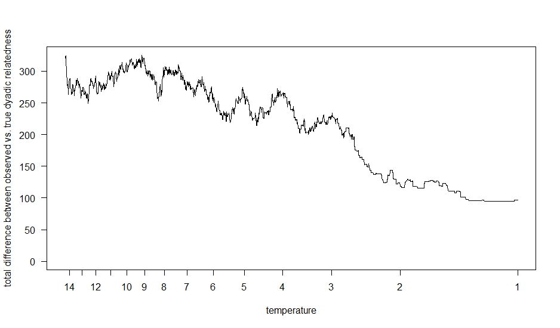

 # pedigree programme

The programme, described in the following, is a pedigree analysis tool, which was developed and implemented as part of a bioinformatic's master thesis in 2023 at Leipzig University. It is a C++ written console application, which was designed to calculate dyadic relatedness coefficients from a given pedigree without being limited by the number of considered generations, the number of individuals, or the depth N OF GENERATION IS SAME AS DEPTH? and incompleteness of the pedigree itself. Additionally, the programme provides some further information about the respective relatedness paths between the focal individuals, such as the name and sex of ancestors along the path, the most DISTANT OR RECENT? common ancestors, the kinlabel BETTER KIN CLASS (e.g. siblings or cousins), or the minimal detectable inbreeding value for each individual. The functionality and accuracy was adequately tested with multiple simulated populations as well as with an existing multi-generational pedigree established for the free-ranging population of rhesus macacaque (Macaca mulatta) on the island of Cayo Santiago (Puerto Rico, USA) that covers a time span of over 60 years and consists of a total of 12 049 individuals [^1]. Contrary to other pedigree analysis, which are often limited in the number of considered generations (like [^1]), the graph-theoretical approach NEEDS REF! enables a generational unrestricted calculation of the dyadic relatedness coefficients.

Since scientists working on wild populations often have to deal with partial pedigrees (mainly due to unknown sires), the second part of the programme focuses on the implementation of an adapted simulated annealing algorithm to find the best solution for a fully-reconstructed pedigree based on realized relatedness values THIS NEEDS TO BE DEFINED USING THE TERM IBD, obtained from whole genome sequencing data or large sets of single nucleotide polymorphisms [^2] [^3]. Eventually, it aims to provide a pedigree without gaps for which the difference between the given realized relatedness values and the simultaneously calculated pedigree-derived relatedness coeffiecients is minimal over all dyads (see more informations in the section _Implementation/Simulated annealing_). While patterns of relatedness in group living animals with promiscous mating can be really complex, assessing dyadic relatedness from sequencing data is providing the most accurate way to do so. However, at the behavioural level it will be important to still consider kin classes (e.g. maternal half-siblings, paternal cousins etc.) instead of using a global measure of IBD. LASS DEN SATZ ANNIKA NOCHMAL ANSCHAUEN, SIE WEIß WAS ICH MEINE. 

## Getting Started

Installation guide

 
- download (and don't forget to unzip) the repository to your local filesystem
- after downloading the source code, open the command line and navigate within the terminal into the folder _pedigree_programme/source/_
  - you can use `ls` to check if you are in the correct folder and if all the necessary files were downloaded: multiple headerfiles (.h), the respective source code files (.cpp), _main.cpp_ and the makefile _makefile_pedigree_programme_
- run in the command line `make -f makefile_pedigree_programme`
  - this program is written using C++17 features and relies on the C++ Standard Library, which is typically included within the C++ compiler. Therefore, no additional library installations are necessary. However, please ensure that your compiler supports C++17 standards. 
  - if you have trouble with make on windows UNKLAR TROUBLE WITH WHAT?:_'make' is not recognized as an internal or external command, operable programme or batch file._
    - either download [Cygwin](https://www.cygwin.com/install.html), use the setup exe to install _make_ and _gcc/g++_, move the programme folder to Cygwin and run the command in the Cygwin Terminal
    <!-- Cygwin Setup Installation Tutorial Youtube by C Plus+: https://www.youtube.com/watch?v=2ypfJZ6YuVo -->
    - or install [MinGW](https://sourceforge.net/projects/mingw/files/Installer/mingw-get-setup.exe/download), set a new environment variable to the bin folder of mingw, install make by `mingw-get install mingw32-make` or the MinGW Interface (started by `mingw-get`) and use the command `mingw32-make -f makefile_pedigree_programme` instead
  <!-- MinGW Setup Installation Tutorial Youtube by PascalLandau: https://www.youtube.com/watch?v=taCJhnBXG_w-->
- now you can use the command `./pedigree_programme` to start the programme
- for general information you can type `./pedigree_programme -h` to list all possible command line arguments, or `./pedigree_programme -v` to get the current version

Command line arguments

The pedigree programme provides three different functionalities: "relatedness","simulation", and "annealing", that could be chosen by the command line argument `-f <functionality>`.
 - _relatedness_: calculates the dyadic relatedness (+ path characteristics) from a given (partial or complete) pedigree
 - _simulation_: simulates a random population and returns a complete pedigree
 - _annealing_: starts a simulated annealing algorithm to fill the parental gaps within a partial pedigree using dyadic values of realized relatedness (IBD)
 - if no argument is given, the programme starts without task, gives a short warning and terminates

For each mode, further required and optional arguments are listed below:

functionality == relatedness

#### required arguments
- `-p <input_pedigree>` [string]: path to pedigree file, e.g. _pedigree.txt_

#### optional arguments
- `-c <cores>` [int]
  - **options**: number of cores for multiprocessing
  - **default**: 1 (no multiprocessing)
- `-d <input_dyadlist>` [string]
  - **options**: path to file with selected dyads e.g. _dyad_selection.txt_
  - **default**: [empty] (all dyads within the pedigree will be analysed)
- `-e <output_extend>` [string]
  - **options**:
    - _full_: returns the full dyadlist output, including path characteristics
    - _reduced_: returns only dyadlist with dyadic relatedness coefficients
  - **default**: full
- `-l <generation_limit>` [int]
  - **options**: restricts the distance to potential lowest common ancestors, e.g. if generation_limit == _3_, only paths up to the grandparent generation will be returned, great-grand-parents will be considered as unrelated
  - **default**: [empty] (no limitation; all ancestors of a focal will be considered as potential lowest common ancestor)
- `-o <output>` [string]
  - **options**: custom output name (prefix) e.g. if output == _programme_output_, the resulting output files will be named "programme_output_dyadlist.txt" and "programme_output_info.txt"
  - **default**: [empty] (the input file name will be used as prefix)
- `-r <reduce_node_space>` [bool]
  - **options**:
    - _true_: before calculating the dyadic relatedness, the number of individuals will be reduced which means that only descendants of the focal's common ancestors will be considered in the analysis (it effectively reduces the search space without affecting the result, but might be only beneficial in almost completely known pedigrees with a long history due to the extra computational cost)
    - _false_: no prior narrowing of the search space
  - **default**: false

#### Example
`./pedigree_programme -f relatedness -p pedigree.txt -e reduced -c 5`

functionality == simulation

#### required arguments
- `-n <start_individual>` [int]: number of individuals at the start of the simulation
- `-s <simulation_duration>` [int]: number of years considered in pedigree to restrict the duration of the simulation

#### optional arguments
- `-a <max_age>` [int]
  - **options**: species-/population specific age maximum (individuals who reach the maximum age will decease in the following year)
  - **default**: 30
- `-b <birth_rate>` [double]
  - **options**: specifies the annual increment in the number of offsprings born each year during the population simulation
  - **default**: 4.0
- `-q <death_rate>` [double]
  - **options**: specifies the annual increment in the number of deaths each year during the population simulation
  - **default**: 3.0
- `-y <default_year>` [int]
  - **options**: start year for population simulation
  - **default**: 1900

#### Example
`./pedigree_programme -f simulation -n 20 -s 10 -y 1938`

functionality == annealing

#### required arguments
- `-d <input_dyads_complete>` [string]: path to dyadlist with realized relatedness values, e.g. _true_dyads.txt_
- `-p <input_pedigree>` [string]: path to pedigree file (with gaps), e.g. _pedigree.txt_

#### optional arguments
- `-c <cores>` [int]
  - **options**: number of cores for multiprocessing
  - **default**: 1 (no multiprocessing)
- `-i <init_temp>` [double]
  - **options**: start temperature
  - **default**: [empty] (automatically calculated by $\text{start temperature = init factor (= highest mean relatedness of an individual}) \cdot n_{nodes} \cdot 1.5$
- `-k <visualization>` [bool]
  - **options**:
    - _true_: keep track of simulated annealing steps (the respective relatedness variance and if they are rejected)
    - _false_: prior simulated annealing steps are not recorded/returned
  - **default**: true
- `-t <stop_temp>` [double]
  - **options**: stop temperature, if current temperature falls below stop temperature, the algorithm terminates
  - **default**: 1.0
- `-x <temp_decay>` [double]
  - **options**: the temperature multiplication factor to determine the number of iterations (if the number of iteration _n_ is set, the decay factor can be calculated with temp_decay = $\sqrt[n]{\frac{t_{stop}}{t_{init}}} $
  - **default**: 0.99
- `-z <complete_pedigree>` [string]
  - **options**: path to complete pedigree if full known pedigree exists (with all gaps correctly filled) and if it should be used to evaluate accuracy of simulated annealing output
  - **default**: [empty] (no comparison whether gaps are correctly filled in the end of the simulated annealing)

#### Example
`./pedigree_programme -f annealing -p pedigree_with_gaps.txt -d realized_dyadic_relatedness.txt -x 0.995 -c 5 -m 1000 -w 1000`

#### general optional arguments
- `-g <gestation_length>` [int]
  - **options**: gestation length in days
  - **default**: 200
- `-j <twins>` [bool]
  - **options**:
    - _true_: twins are possible
    - _false_: twins are not possible or rare to the point that potential mom candidates can be excluded if the have already an offspring in the respective birth cohort
  - **default**: false
- `-m <maturation_age_m>` [int]
  - **options**: maturation age of males in days
  - **default**: 1250
- `-w <maturation_age_f>` [int]
  - **options**: maturation age of females in days
  - **default**: 1095

## Input requirements

Pedigree files

Pedigree file in this context refers to a file, containing a table with information for each individual in the population per row. Since the programme is able to handle gaps (missing parental data), both a complete or partial pedigree can be passed as argument to calculate relatedness coefficients.

 - Input file format: .txt (tab-separated)
- no header
- empty NA values (like "") lead to adverse behaviour or programme abort
- columns (order and format is mandatory): ID, sex, birthseason/year, mom_ID, sire_ID, day of birth (DOB), day of death (DOD), nonsire, nondam
  WOULD ALL NONSIREs AND NONDAMS of group or pop need to be listed? SOMETIMES WE MAY NOT KNOW, if their is extra-group paternity in a spp, all adult males in pop are likely fathers (hence here non-sires minues dad)

|column|data type|missing value|comment|
|-|-|-|-|
|ID |string| cannot be supported; no NA values possible|ID names have to be unique and have to be unambiguously assignable to parent IDs; every parent ID from mom_ID or sire_ID has to be listed in the pedigree file separately; ID names like _UNK_, _NA_, _unknown_, _unkn_f_, and _unkn_m_ have to be avoided
|sex |char| u| usage of the following options only _f_ = female, _m_ = male, or _u_ = unknown sex
|birthseason |int|0| year
|mom_ID |string|unknown| have to be relatable to exactly one ID, respectively one female individual in the pedigree file
|sire_ID |string|unknown| have to be relatable to exactly one ID, respectively one male individual in the pedigree file WHAT IF THSI IS UNKNOWN?
|DOB |string (dateformat)| NA| in the format: 01-01-1900
|DOD |string (dateformat)|NA| in the format: 01-01-1900
|nonsire |string| NA|IDs of previously excluded sires strung together (have to be relatable to exactly one ID of the respective sex in the pedigree); separated by @ e.g. _indiv1@indiv2@indiv3_; ensure that each individual has at least one remaining potential sire within the pedigree, else the individual will be assumed to be a founder individual (FOUNDER CAN HAVE OFFSPRING TOO; TERM CONFUSING)
|nondam |string| NA|IDs of previously excluded moms strung together (have to be relatable to exactly one ID of the respective sex in the pedigree); separated by @ e.g. _indiv1@indiv2@indiv3_; ensure that each individual has at least one remaining potential mother within the pedigree, else the individual will be assumed to be a founder individual|

- [example 1](example/relatedness_calculation/example_input_pedigree.txt) or [example 2](example/population_simulation/example_simulation.txt)

Dyadic files

#### Dyad Selection (Relatedness Calculation)
- Input file format: .txt (tab-separated)
- no header
- empty NA values (like "") lead to adverse behaviour or programme abort
- columns (order and format is mandatory): ID_1, ID_2
  - ID names have to be unique and have to be unambiguously assignable to pedigree IDs; every focal ID has to be listed in the pedigree separately; ID names like _UNK_, _NA_, _unknown_, _unkn_f_, and _unkn_m_ have to be avoided
- [example](example/relatedness_calculation/example_input_dyad_selection.txt)

#### Dyadic relatedness information (Simulated Annealing: realized and pedigree-derived relatedness values)
- Input file format: .txt (tab-separated)
- no header
- empty NA values (like "") lead to adverse behaviour or programme abort
- only dyads listed within this file will be considered as relevant for minimizing the variance between the pedigree-derived relatedness coefficient and the realized realtedness value
- columns (order and format is mandatory): ID_1, ID_2, pedigree_r, real_r
  - ID names have to be unique and have to be unambiguously assignable to pedigree IDs; every focal ID has to be listed in the pedigree separately; ID names like _UNK_, _NA_, _unknown_, _unkn_f_, and _unkn_m_ have to be avoided
  - pedigree_r: dyadic relatedness coefficient from the incomplete pedigree; no NA values possible
  - real_r: realized relatedness values of the dyad, obtained for instance from shared IBD segments; no NA values possible
- [example](example/simulated_annealing/example_simulation_dyads.txt)

## Example

Relatedness calculation

 

  

 
To calculate the dyadic relatedness for some selected dyads of the above-plotted partial pedigree I MISSED THIS GIVE LINE NUMBER OR THE ONE BELOW?, two input files are required: the pedigree file itself (one individual per row) and the preselected set of dyads to consider. The files used for that example are listed in the subsection **Input files**, while the resulting output (relatedness coefficients, path characteristics for the selected dyads,  minimal inbreeding value and number of completely known generations per individual) can be viewed in the second section **Output files**. 

I. Input files

#### Input file (pedigree)

|ID|sex|birthseason|mom|sire|DOB|DOD|nonsire|nondam|
| ------------- | ------------- | ------------- | ------------- | ------------- | ------------- | ------------- | ------------- | ------------- |
|A|f|1905|unknown|unknown|01-01-1900|NA|NA|NA|
|B|f|1911|A|unknown|01-01-1911|NA|NA|NA|
|C|m|1912|unknown|unknown|01-01-1912|NA|NA|NA|
|D|f|1913|A|unknown|01-01-1913|NA|NA|NA|
|E|f|1914|A|unknown|01-01-1914|NA|NA|NA|
|F|m|1915|unknown|unknown|01-01-1915|NA|NA|NA|
|G|m|1920|B|unknown|01-01-1920|NA|NA|NA|
|H|f|1921|D|C|01-01-1921|NA|NA|NA|
|I|m|1922|E|F|01-01-1922|NA|NA|NA|
|J|m|1923|E|F|01-01-1923|NA|NA|NA|
|K|m|1928|H|G|01-01-1928|NA|NA|NA|
|L|f|1929|H|I|01-01-1929|NA|NA|NA|

[example_input_pedigree.txt](example/relatedness_calculation/example_input_pedigree.txt)

#### Input file (dyad selection)

|ID_1|ID_2|
| ------------- | ------------- |
|C|F|
|H|L|
|I|J|
|K|L|
|C|G|
|D|G|
|D|J|

[example_input_dyad_selection.txt](example/relatedness_calculation/example_input_dyad_selection.txt)

II. Output files

#### Output file (pedigree): additional pedigree info like generational depth and minimal inbreeding value WAS OBEN NICHT ERWÄHNT WURDE; WAS SIND POT SIRE/MOM, HIESS DAS IM INPUT NICHT NONSIRES etc. WENN DIE ELTERN KLAR SIND; IST DAS NOCH NICHT SINNVOLL?

|ID|sex|BS|mom|sire|DOB|DOD|pot_sire|pot_mom|full_generations|min_f|
| ------------- | ------------- | ------------- | ------------- | ------------- | ------------- | ------------- | ------------- | ------------- | ------------- | ------------- |
|A|f|1905|unkn_f|unkn_m|1-1-1900|0-0-0|NA|NA|1|0.000000000000000|
|B|f|1911|A|unkn_m|1-1-1911|0-0-0|NA|NA|1|0.000000000000000|
|C|m|1912|unkn_f|unkn_m|1-1-1912|0-0-0|NA|NA|1|0.000000000000000|
|D|f|1913|A|unkn_m|1-1-1913|0-0-0|NA|NA|1|0.000000000000000|
|E|f|1914|A|unkn_m|1-1-1914|0-0-0|NA|NA|1|0.000000000000000|
|F|m|1915|unkn_f|unkn_m|1-1-1915|0-0-0|NA|NA|1|0.000000000000000|
|G|m|1920|B|unkn_m|1-1-1920|0-0-0|NA|NA|1|0.000000000000000|
|H|f|1921|D|C|1-1-1921|0-0-0|NA|NA|2|0.000000000000000|
|I|m|1922|E|F|1-1-1922|0-0-0|NA|NA|2|0.000000000000000|
|J|m|1923|E|F|1-1-1923|0-0-0|NA|NA|2|0.000000000000000|
|K|m|1928|H|G|1-1-1928|0-0-0|NA|NA|2|0.031250000000000|
|L|f|1929|H|I|1-1-1929|0-0-0|NA|NA|3|0.031250000000000|

[example_output_pedigree_info.txt](example/relatedness_calculation/example_output_pedigree_info.txt)

#### Output file (dyadlist): path characteristics

|ID 1|ID 2|dyad|relatedness coefficient|paths|pathline|kinline|LCA|depth|kinlabel|fullhalf|min_DGD| ICH DENKE DAS MUSS MEHR (BEISPIEL) ERKLÄRT WERDEN WIE MAN paths|pathline|kinline|LCA|depth|kinlabel|fullhalf|min_DGD| liest bzw was das bedeutet oder habe ich etwas überlesen?
| ------------- | ------------- | ------------- | ------------- | ------------- | ------------- | ------------- | ------------- | ------------- | ------------- | ------------- | ------------- |
|C|F|C_F|0|NA|NA|NA|NA|NA|nonkin|NA|1|
|H|L|H_L|0.531250000000000|H@L/@/H@D@A@E@I@L|ff/@/ffffmf|mat/@/mixed|H/@/A|0/1/@/2/3|daughter&mother/@/1st-cousins-once-removed|half/@/half|2|
|I|J|I_J|0.500000000000000|I@E@J/@/I@F@J|mfm/@/mmm|mat/@/pat|E/@/F|1/1/@/1/1|brothers/@/brothers|full/@/full|2|
|K|L|K_L|0.296875000000000|K@H@L/@/K@H@D@A@E@I@L/@/K@G@B@A@D@H@L/@/K@G@B@A@E@I@L|mff/@/mffffmf/@/mmfffff/@/mmfffmf|mat/@/mixed/@/mixed/@/mixed|H/@/A/@/A/@/A|1/1/@/3/3/@/3/3/@/3/3|siblings/@/2nd-cousins/@/2nd-cousins/@/2nd-cousins|half/@/half/@/half/@/half|2|
|C|G|C_G|0|NA|NA|NA|NA|NA|nonkin|NA|1|
|D|G|D_G|0.125000000000000|D@A@B@G|fffm|mat|A|1/2|nephew&aunt|half|1|
|D|J|D_J|0.125000000000000|D@A@E@J|fffm|mat|A|1/2|nephew&aunt|half|1|

[example_output_dyadlist.txt](example/relatedness_calculation/example_output_dyadlist.txt)

 III. Output explanation (path characteristics)

To further explain the column in the dyadlist output, we will look on the examplary dyad (E_G) from the pedigree example above. The focal individuals E (circle = female) and G (square = male) are related only by maternal ancestors (kinline = mat), whereby the lowest common ancestor A is one edge apart from E and two from G (depth = 1/2) which codes in combination with the sex for the kinlabel nephew/aunt. Each focal has at least one unknown parent, therefore the min DGD is 1. DAS IST GUT ABER UNVOLLSTÄNDIG UND BEZIEHT SICH BESSER AUF BSP VON LINE 269-ff.

> The following table is taken from the Master's thesis by Hendrikje Westphal, submitted in December 2023 at Leipzig University, Germany

|name | explanation | example |
| ------------- | ------------- | ------------- |
|path | consecutive list of nodes along the relatedness path (edge directions are left unregarded) | E@A@B@G|
|lca | lowest common ancestor within path | A | SEE ABOVE; RIGHT TERM I DN'T GET WHAT YOU MEAN
|pathline | sequence of sexes (f/m/u) along the path | fffm |
|kinline | whether the path consists solely of maternal or paternal ancestors; “mixed” if both sexes occur | mat | WHAT HAS SEX TO DO WITH KIN LINE? mixed to me means if pat and mat related (includes a female and a males, yes, but this sounds confusing as is
|depth | path length from LCA to each focal | 1/2 |
|kinlabel | kinclass label based on the table of consanguinity (see below) | nephew-aunt |
|fullhalf | whether two identical paths exist with different common ancestors, e.g. to differentiate between full- and half-siblings | half |
|min\_DGD | minimal dyadic genealogical depth states the pedigree completeness for the dyad; i.e. the minimal amount of fully resolved generations starting from both focals | 1 |
DAS SOLLTE WEITER HOCH; WENN DU OUTPUT FILE EINFÜHRST

https://upload.wikimedia.org/wikipedia/commons/0/0d/Table_of_Consanguinity_showing_degrees_of_relationship.svg

 

##

Population Simulation

examplary output of a simulated pedigree with 20 founder individuals born/start in 1950, simulated for 10 years: [simulated pedigree](example/population_simulation/example_simulation.txt) and the respective list of [dyadic relatedness coefficients](example/population_simulation/example_simulation_dyadic_paths.txt) for all 117 individual (1442 dyads) WHERE IS THE 117 coming from, I assume descendent of the 20 founders? EXPLAIN HOW MANY GAPS YOU INSTALLED HERE.
- created with: `./pedigree_programme -f simulation -n 20 -s 10 -y 1950 -o ../example/population_simulation/example_simulation`

Simulated Annealing

examplary simulated annealing based on the simulated pedigree above
- [partial pedigree](example/simulated_annealing/example_simulation_incomplete.txt): randomly added paternal gap with a probability of 50% in all descendants of the simulated population
- [complete pedigree](example/population_simulation/example_simulation.txt): file from population simulation
- [dyads](example/simulated_annealing/example_simulation_dyads.txt): combined list of relatedness coefficients for each dyad, (1) from incomplete/partial pedigree and (2) from complete pedigree with added recombination noise (ERKLÄREN?)
- simulated annealing started with `.\pedigree_programme -f annealing -p ..\example\simulated_annealing\example_simulation_incomplete.txt -d ..\example\simulated_annealing\example_simulation_dyads.txt -o ..\example\simulated_annealing\example_annealing_output -z ..\example\population_simulation\example_simulation.txt -x 0.999`
- output files: [final pedigree solution](example/simulated_annealing/example_annealing_output_annealed.txt) after simulated annealing, [start solution pedigree](example/simulated_annealing/example_annealing_output_start_solution.txt) (randomly filled pedigree) and [visualization data](example/simulated_annealing/example_annealing_output_visualization.txt)
- simulated annealing assigned 39/43 gaps (90.7%) correctly (time: 1 minute, iterations: 2665) and therefore reduced unknown relatedness from 321 to 96 dyads/gaps? (-70%), see simulated annealing graph (plotted visualization data) FINDE ICH NICHT. A minimization of gaps towards 0 is highly unlikely due to the existing recombination variance in the (simulated) realized relatedness values from whole genome sequencing (UNCLEAR DID YOU USED WGS HERE OR SIMULATIONS?) in comparison to the statistical average relatedness values provided by pedigree data. ICH DENKE DAS MÜSSTE KLARER WERDEN.

  

## Implementation

Relatedness Coefficient

#### Recursive relatedness coefficient calculation EXPLAIN TERM RECURSIVE

> The following paragraphs and formulas are an excerpt from the Master's thesis by Hendrikje Westphal, submitted in December 2023 at Leipzig University, Germany YOU SAID THIS ABOVE ALREADY oR ARE YOU SAYING YOU COPIED THSI FROM YOUR TEHSIS?

To calculate the dyadic relatedness coefficient, the (partial) pedigree G is conceived as a directed, acyclic graph, consisting of two distinct classes of vertices, $V_1$ (males) and $V_2$ (females) whereas each vertex represents an individual. Edges within the graph referred to one-directional, direct kinship bonds between parent and offspring, which implies that for each (heterogamous) node at least two edges exist (to the mother and to the father), or more in case of own offspring. COUDL YOU ILLSUTRATE THIS SO PEOPLE UNDERSTAND GRAPH THEORY A BIT MORE? But while in reality, pedigrees often consists of missing parents, two imaginary nodes $\rho_1\ \epsilon\ V_1$ and $\rho_2\ \epsilon\ V_2$ are added, serving as a compensatory substitute for unknown mothers or sires.

Generally, the relatedness coefficient of an individual $x\ \epsilon\ V$ to itself is stated as $f\left(x,x\right)=1$ while the relatedness of two different focals $f\left(x,y\right)$ can be expressed by the following recursive formula
$$f\left(x,y\right)=\ \frac{1}{4}\left[f\left(x_1,y_1\right)+f\left(x_1,y_2\right)+f\left(x_2,y_1\right)+f(x_2,y_2)\right]$$ ($x_1,\ x_2$ as parents of $x$; $y_1,\ y_2$ as parents of $y$ while $x_1,\ y_1\ \epsilon\ V_1$ and $x_2,\ y_2\ \epsilon\ V_2$).
In the particular case of determining the relatedness coefficient between an individual $x$ and its ancestor $x_i$, it is calculated by
$$f\left(x,x_i\right)=\ \frac{1}{2}\left[f\left(x_1,x_i\right)+f\left(x_2,x_i\right)\right]$$
($x,\ x_i\ \epsilon\ V;\ x_1\ \epsilon\ V_1$ and $x_2\ \epsilon\ V_2$ as parents of $x$). Even more specific, if $x_i \equiv x_1 \lor x_2$, the relatedness between parent and offspring is given by
$$f\left(x,x_1\right)=\ \frac{1}{2}\left[1+f\left(x_1,x_2\right)\right]$$
At last, in case of imaginary nodes, $\rho_1$ and $\rho_2$ are assumed as unrelated to each other or any other individual $x\ \epsilon\ V:$
$$f\left(\rho_1,\rho_2\right)=f\left(x,\rho_1\right)=f\left(x,\rho_2\right)=0$$
Based on these functions, the programme computes the relatedness between a dyad step by step until it either identifies their lowest common ancestor or terminates due to a trivial solution WHAT IS MEANT HERE.

Simulated Annealing 

#### Adapted Simulated Annealing Algorithm 
> The following synapsis is an excerpt from the Master's thesis by Hendrikje Westphal, submitted in December 2023 at Leipzig University, Germany

Within the programme a simulated annealing algorithm is implemented to fill possibly existing gaps within a given pedigree. Therefore, it uses the discrepancy between user-provided realized relatedness values (e.g. obtained from whole genome sequencing) and the calculated pedigree-derived relatedness values as cost function. This is highly relevant, if e.g. a DNA sample of a sire are missing, hence offspring related over this father could not have been identified so far. While trying to minimize the cost/discrepancy by simulated annealing, the aim is to find the pedigree solution which explains best the variance. In our example, this would result that paternal half-siblings (offspring sharing the father) were identified based on while genome sequencing data, even if the ID of the father is unknown based on the missing DNA. However, this may be accompanied with an underestimation of relatedness values WHY?.

$$F =\Sigma\ |f(x,y) - g(x,y) | \to min$$ (with $f(x,y)$ as the pedigree-based dyadic relatedness and $g(x,y)$ as the dyadic realized relatedness)
To fit the specific problem, the general simulated annealing algorithm is adapted as explained in the following outline:

- At first, all pedigree gaps need to be identified.
- Create an initial solution by randomly assigning parents from a pool of suitable candidates for each gap. Suitable candidate are parents who were alive and mature at the time of conception (sire) or birth (mother) and were not excluded as potential parent priorly due to genetic analysis or because a female has already an offspring in the respective cohort THiS SHOUDL GO, females rarely can have twins.
- Calculation of the relatedness coefficient for each relevant dyad (those for which realized relatedness values are available)
- Evaluate the difference between the realized and pedigree-derived relatedness values of the initial solution for each relevant dyad
- Save the current difference as the best-known difference, and the initial solution as the best pedigree.
- Iteration: While the current temperature is above the (given) stop temperature: MIT DER TEMPERATURE DAS IST VERWIRREND! KANN MAN DAS UMSCHREIBEN?
  - Create a new solution by exchanging one potential parent with another suitable candidate.
  - Calculate new relatedness values for dyads affected by this change (all relevant dyads which include the offspring, the old and the new parent candidate).
  - Compare the old and new relatedness values to determine the discrepancy between the initial and new solution.
  - If the new solution is worse, apply the Metropolis acceptance criterion REf needed! to decide whether to accept it or not: $$e^\frac{F_{n}-F_{c}}{T} > X\to [0,1]$$
 (with $F_n$ as fitness function of the new solution and $F_c$ of the current solution; $T$ as temperature and $X$ as random number in the range between 0 and 1)
  - If accepted (or the new solution is better in the first place), the new solution becomes the current solution; otherwise, it's rejected, and the previous solution remains in place. I AM CNFUSING BY INITIAL; NEW AND CURRENT SOLUTIONS. ARE THESE ALL DIFFERENT TERMS?
  - If necessary, update the best difference and pedigree.
- Finally, save the last pedigree solution in a file.

## Contribution and citation
We want to thank and express our deep gratitude to all people who supported and contributed to this project LIST THEM HERE, with special thanks to R. McElreath und P. Fröhlich for the provided server space and comprehensive IT support.

Please use the BibTex format, provided by Github or cite this programme as

**Westphal et al. (2023). Pedigree programme (Version 1.0.0) [Computer software].** _https://github.com/Hendrikjen/pedigree_programme_

Contact email: hendrikje.westphal@gmx.de

[^1]: Widdig, A., Muniz, L., Minkner, M., Barth, Y., Bley, S., Ruiz-Lambides, A., ... & Kulik, L. (2017). Low incidence of inbreeding in a long-lived primate population isolated for 75 years. Behavioral ecology and sociobiology, 71, 1-15. [https://doi.org/10.1007/s00265-016-2236-6](https://doi.org/10.1007/s00265-016-2236-6)

[^2]: Wang, B., Sverdlov, S., & Thompson, E. (2017). Efficient estimation of realized kinship from single nucleotide polymorphism genotypes. Genetics, 205(3), 1063-1078. [https://doi.org/10.1534/genetics.116.197004](https://doi.org/10.1534/genetics.116.197004)

[^3]: Li, H., Glusman, G., Hu, H., Caballero, J., Hubley, R., Witherspoon, D., ... & Huff, C. D. (2014). Relationship estimation from whole-genome sequence data. PLoS genetics, 10(1), e1004144. [https://doi.org/10.1371/journal.pgen.1004144](https://doi.org/10.1371/journal.pgen.1004144)
